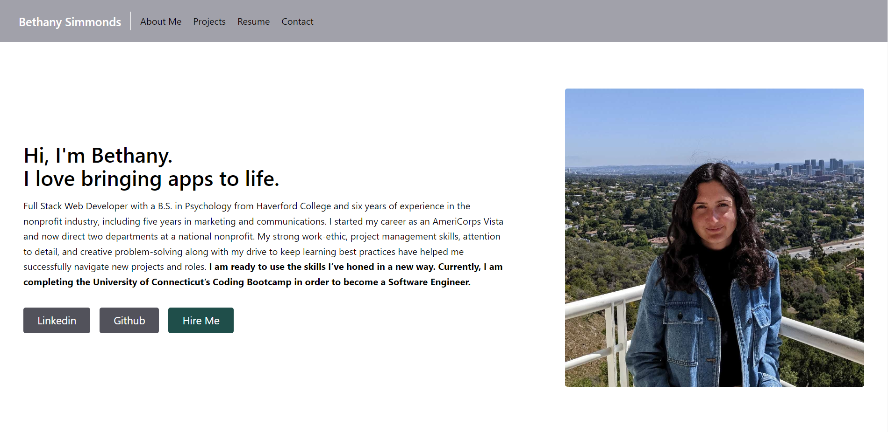

# react-portfolio
## Description
I built a single-page React portfolio to share my projects and resume with potential employers. 

## Table of Contents
- [Description](#description)
- [Installation](#installation)
- [Usage](#usage)
- [Sources](#sources)
- [Contributing](#contributing)
- [Questions](#questions)

## Installation
The application will be invoked by using the following command: 
- npm install
- npm start

## Usage
As a developer, I want to create a deployed React portfolio so that employers know I have experience building single-page applications.

## Sources
- [Tailwind Starter Kit](https://www.creative-tim.com/learning-lab/tailwind-starter-kit/documentation/react/modals/regular)
- [DotNet Queries](http://dotnetqueries.com/Article/162/how-to-display-pdf-in-bootstrap-modal-popup)
- [Free Code Camp](https://www.freecodecamp.org/news/build-portfolio-website-react/)
- [Tailwind Docs](https://tailwindcss.com/docs/installation)
- [React Docs](https://react.dev/learn)

## Contributing
Thank you for your interest in my project. I am excited to see your contributions. Please follow the [Contributor Covenant](https://www.contributor-covenant.org/).

## Questions
If you have additional questions, please email me at bsimmonds28@gmail.com.
To see more of my work, find me on GitHub at [bsimmonds28](https://github.com/bsimmonds28)!